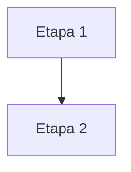

# Mapa de fluxo: <escopo, ex: piloto>

Este documento e a fonte unica da composicao: quais etapas e casos de
uso existem em cada convenio, em que ordem e qual template cada um usa.
Uma etapa ausente nunca vira booleano. A definicao da etapa esta em
`docs/etapas/`; a regra que justifica uma diferenca esta no manual do
cluster.

Renomeie o arquivo para `mapa-fluxo-<escopo>.md`.

## Escopo
- Modalidade: <primeira concessao | refinanciamento>
- Convenios cobertos: <lista>

## Tabela de composicao

Uma linha por etapa ou tela, uma coluna por convenio. Em cada celula,
preencha `nao`, `padrao`, `especializacao:<id>` ou `[CONFIRMAR]`.
`<id>` precisa existir em `docs/etapas/<etapa>.md`.

| # | Etapa / tela | Caso de uso | Nivel | Gatilho | <convenio A> | <convenio B> |
| --- | --- | --- | --- | --- | --- | --- |
| 1 | <ex: anuencia/confirmacao> | <caminho feliz> | 1 | n/a | padrao | especializacao:confirmacao-com-matricula |
| 2 | <ex: detalhe da anuencia> | <caminho feliz> | 2 | <texto real> | padrao | nao |

Nivel 1 = obrigatorio no fluxo. Nivel 2 = tela de apoio, aberta de uma
etapa de nivel 1. `padrao` seleciona o template-base da etapa. Uma
especializacao seleciona o template funcional aprovado no catalogo.

## Grafo por convenio e caso de uso

A tabela compara presenca e selecao. O grafo registra ordem,
bifurcacao e retorno. Ele e gerado pelo Analista a partir do prototipo,
nunca desenhado de memoria.

### Notacao fixa

| Simbolo | Significado |
| --- | --- |
| `[texto]` | etapa de nivel 1 |
| `([texto])` | desdobramento de nivel 2 |
| `{texto}` | ramo de excecao |
| `-->` | avanco no fluxo principal |
| `-.->` | ida e volta de desdobramento |
| `|gatilho|` | texto real do elemento que dispara |
| no apontando para si mesmo | estado de espera passiva |

### <convenio A> - <caso de uso>

### <convenio B> - <caso de uso>

## Justificativas das diferencas

Toda diferenca de `nao`, ordem ou especializacao precisa apontar uma
regra ativa no manual do cluster. Sem regra, use `[CONFIRMAR]`.

| Divergencia | Cluster | Regra que explica |
| --- | --- | --- |
| <descricao> | <cluster> | <manual, regra R1 ou [CONFIRMAR]> |

## Historico
- <data>: <o que mudou e por que>
