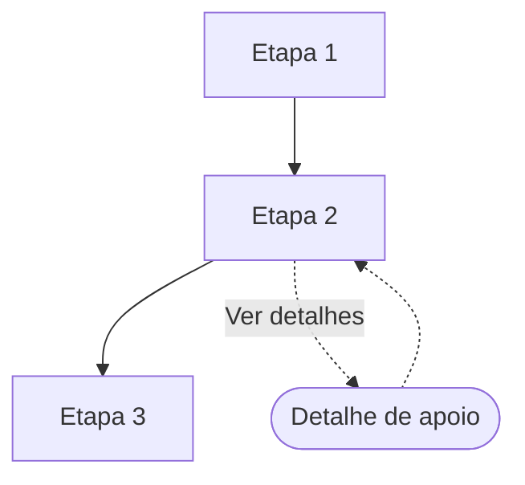

# Mapa de fluxo: <escopo, ex: piloto>

Este documento responde: **quais telas existem em cada convenio, em que
ordem?** E o unico lugar onde mora a composicao do fluxo. Uma etapa que
existe num convenio e nao noutro se resolve AQUI, nunca com variavel
booleana no Figma.

Renomeie o arquivo para `mapa-fluxo-<escopo>.md`.

## Escopo
- Modalidade: <primeira concessao | refinanciamento>
- Caso: <caminho feliz | ramo de excecao: qual>
- Convenios cobertos: <lista>

## Tabela

Uma linha por etapa/tela, uma coluna por convenio. Preencha com:
`sim` (existe), `nao` (nao existe), `opcional` (nivel 2, abre de dentro
de outra), ou `[CONFIRMAR]`.

| # | Etapa / tela | Nivel | <convenio A> | <convenio B> |
| --- | --- | --- | --- | --- |
| 1 | <ex: consentimento> | 1 | sim | nao |
| 2 | <ex: simulacao> | 1 | sim | sim |
| 3 | <ex: detalhe do seguro> | 2 | opcional | nao |

Nivel 1 = etapa obrigatoria do fluxo. Nivel 2 = tela de apoio, abre de
dentro de uma etapa de nivel 1 (detalhe, saiba mais, edicao).

## Grafo por convenio (um diagrama por convenio, por caso de uso)

A tabela acima diz o QUE existe. O grafo diz em que ORDEM, o que
BIFURCA, e o que VOLTA. Sao coisas diferentes e nao se substituem: a
tabela compara N convenios de relance (uma coluna cada), o grafo mostra
a topologia de UM convenio de cada vez.

Se voce se pegar escrevendo prosa numa celula da tabela — "apos a
senha; o retorno atualiza a efetivacao", "abre pelo trail do item" —
essa informacao e de grafo e o lugar dela e aqui.

Este bloco e GERADO pelo comparador a partir do prototipo (Modo
Fluxos), nao desenhado a mao. O prototipo e a fonte; isto e a
documentacao derivada, e o validador confere se as duas ainda batem.

### Notacao (fixa, nao invente outra)

| Simbolo | Significado |
| --- | --- |
| `[texto]` | ETAPA de nivel 1 |
| `([texto])` | DESDOBRAMENTO de nivel 2 (tela de apoio, ida e volta) |
| `{texto}` | RAMO DE EXCECAO (bifurcacao real, 2+ avancos possiveis) |
| `-->` | avanco no fluxo principal |
| `-.->` | ida e volta de desdobramento |
| `\|gatilho\|` | rotulo REAL do elemento que dispara (texto do botao) |
| no apontando para si mesmo | estado de espera passiva |

A classificacao vem da TOPOLOGIA, nunca do rotulo do botao (ver Modo
Fluxos na skill consignado-comparador).

### <convenio A> — <caso de uso, ex: caminho feliz>

### <convenio B> — <caso de uso>

## Divergencias e o porque
Para cada `nao` ou diferenca de ordem, aponte a regra do manual do
convenio que explica. Divergencia sem regra correspondente e
`[CONFIRMAR]`, nunca uma razao inventada.

| Divergencia | Regra que explica |
| --- | --- |
| <ex: consentimento nao existe em A> | <ex: manual do convenio A, regra R1> |

## Historico
- <data>: <o que mudou e por que>
