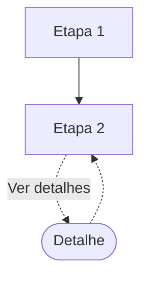
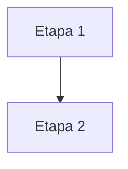

# Mapa de fluxo: <escopo, ex: piloto>

Este documento e a fonte unica da composicao: quais etapas e casos de
uso existem em cada convenio, em que ordem e qual template cada um usa.
Uma etapa ausente nunca vira booleano. A definicao da etapa esta em
`docs/etapas/`; a regra que justifica uma diferenca esta no manual do
cluster.

Renomeie o arquivo para `mapa-fluxo-<escopo>.md`.

## Escopo
- Modalidades: <lista explicita ou [CONFIRMAR]>
- Convenios cobertos: <lista>

## Tabela de composicao de contexto

Uma linha por etapa, tela, handoff ou fronteira, uma coluna por convenio.
No contexto guiado, preencha `presente`, `ausente`, `sem diferenca
registrada` ou `[CONFIRMAR]`. A escolha de template ainda nao existe
nesta fase.

| # | Elemento | Tipo | Caso de uso | Nivel | Gatilho | <convenio A> | <convenio B> |
| --- | --- | --- | --- | --- | --- | --- |
| 1 | <etapa/tela> | etapa ou tela | <caminho feliz> | 1 | n/a | presente | presente |
| 2 | <ex: handoff/validacao-externa> | handoff | <caminho feliz> | 1 | <acao observada> | [CONFIRMAR] | [CONFIRMAR] |

Nivel 1 = caminho principal. Nivel 2 = apoio ou caminho opcional aberto
por acao observada. Handoff e fronteira registram mudanca de contexto da
jornada e nao viram template nem tela inventada.

## Selecao tecnica de template (preenchida pelo Analista)

Somente depois de `/consignado-analise` e da aprovacao humana, registre
o template selecionado para cada tela da etapa. `padrao` seleciona o
template-base; `especializacao:<id>` exige ID funcional aprovado no
catalogo. Handoff e fronteira nunca entram nesta tabela.

| Tela da etapa | <convenio A> | <convenio B> | Fonte da decisao |
| --- | --- | --- | --- |
| <etapa/tela> | padrao | especializacao:<id> | proposta aprovada |

## Grafo por convenio e caso de uso

A tabela de contexto compara presenca. O grafo registra ordem,
bifurcacao e retorno. Ele e gerado pelo Analista a partir das reacoes do
prototipo ou de confirmacao explicita do designer, nunca desenhado de
memoria. Quando a reacao nao estiver exposta, registre
`[VERIFICAR COM DESIGNER]` em vez de criar uma seta.

### Notacao fixa

| Simbolo | Significado |
| --- | --- |
| `[texto]` | etapa de nivel 1 |
| `([texto])` | desdobramento de nivel 2 |
| `{texto}` | ramo de excecao |
| `-->` | avanco no fluxo principal |
| `-.->` | ida e volta de desdobramento |
| `|gatilho|` | texto real do elemento que dispara |
| no apontando para si mesmo | estado de espera passiva |

### <convenio A> - <caso de uso>

### <convenio B> - <caso de uso>

## Justificativas das diferencas

Toda diferenca de `ausente`, ordem ou selecao tecnica precisa apontar uma
regra ativa no manual do cluster. Sem regra, use `[CONFIRMAR]`.

| Divergencia | Cluster | Regra que explica |
| --- | --- | --- |
| <descricao> | <cluster> | <manual, regra R1 ou [CONFIRMAR]> |

## Historico
- <data>: <o que mudou e por que>
