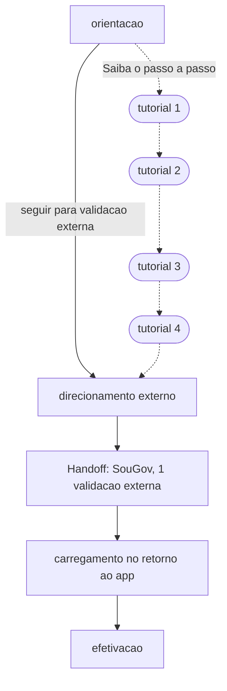

# Mapa de fluxo: anuencia

Este documento e a fonte unica da composicao da etapa de anuencia neste
recorte.

## Escopo
- Modalidades: primeira concessao, refinanciamento, portabilidade
- Convenios cobertos: Cluster 4, Gov SP

## Tabela de composicao de contexto

| # | Elemento | Tipo | Caso de uso | Nivel | Gatilho | Cluster 4 | Gov SP |
| --- | --- | --- | --- | --- | --- | --- | --- |
| 1 | anuencia/orientacao | tela interna | entrada da etapa | 1 | apos a senha transacional | presente | presente |
| 2 | anuencia/tutorial-1 | tela interna | caminho de ajuda opcional | 2 | "Saiba o passo a passo" | presente | presente |
| 3 | anuencia/tutorial-2 | tela interna | caminho de ajuda opcional | 2 | proximo passo | presente | presente |
| 4 | anuencia/tutorial-3 | tela interna | caminho de ajuda opcional | 2 | proximo passo | presente | presente |
| 5 | anuencia/tutorial-4 | tela interna | caminho de ajuda opcional | 2 | ir para validacao externa | presente | presente |
| 6 | anuencia/direcionamento-externo | tela interna | caminho direto e reencontro apos tutorial | 1 | seguir para validacao externa ou fim do tutorial | presente | presente |
| 7 | handoff/validacao-externa | handoff | validacao fora do app | 1 | avancar no direcionamento externo | SouGov, 1 validacao externa | Sou SP, depois prova de vida no gov.br, 2 validacoes externas |
| 8 | fronteira/carregamento-retorno-app | fronteira | retorno da validacao externa | 1 | fim da cadeia externa | presente | presente |
| 9 | fronteira/efetivacao | fronteira | continuidade apos retorno | 1 | avancar no carregamento | presente | presente |

Os itens de handoff e fronteira registram a jornada, mas nao sao telas da
biblioteca nem candidatos a template nesta rodada.

## Grafo por convenio e caso de uso

### Cluster 4

### Gov SP

## Justificativas das diferencas

| Divergencia | Cluster | Regra que explica |
| --- | --- | --- |
| quantidade de validacoes externas | Cluster 4 | `docs/clusters/cluster-4.md`, R1 |
| quantidade de validacoes externas | Gov SP | `docs/clusters/gov-sp.md`, R1 |
| canal da validacao externa | Cluster 4 | `docs/clusters/cluster-4.md`, R1 (SouGov) |
| canal da validacao externa | Gov SP | `docs/clusters/gov-sp.md`, R1 (Sou SP + gov.br) |

## Regra de chamada multipla da etapa

Em portabilidade com refinanciamento, a etapa de anuencia pode ser
chamada duas vezes na jornada:

1. chamada para portabilidade;
2. chamada para refinanciamento apos conclusao da portabilidade.

Em cada chamada, quantidade e formato das validacoes externas seguem as
regras do convenio no manual correspondente.

## Historico
- 2026-08-03: criacao inicial do mapa de fluxo da anuencia em contexto guiado.
