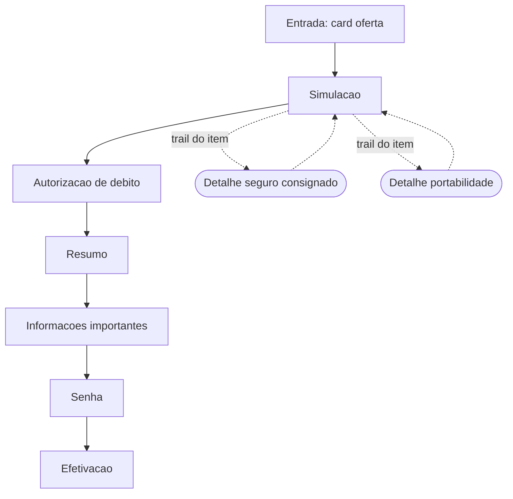
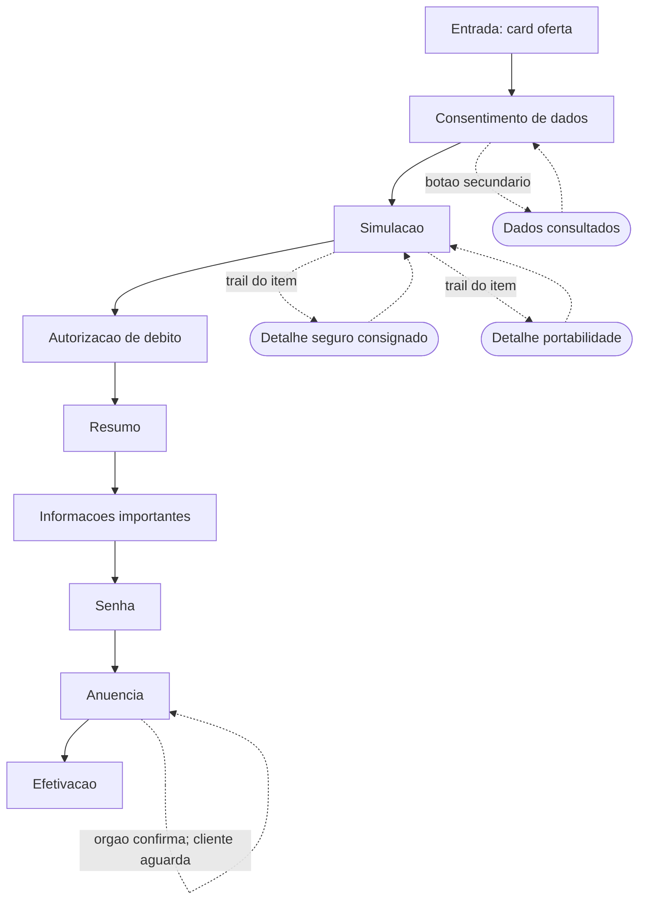
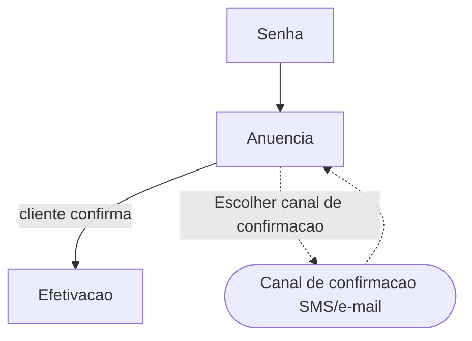

# Mapa de fluxo — consignado OP, primeira concessao (piloto: c1-mg, c4-federais, gov-sp)

Coluna `gov-sp` adicionada em 2026-07-25 a partir do teste do Modo
Fluxos do agente comparador (laboratorio/fila-de-testes.md, Teste 11). Gov SP
é convenio novo, ainda SEM manual proprio confirmado alem do que foi
testado aqui — linhas fora do que foi testado ficam [CONFIRMAR], nao
"nao" por suposicao.

| Etapa | Nivel | c1-mg | c4-federais | gov-sp | Gatilho | Template |
| --- | --- | --- | --- | --- | --- | --- |
| Entrada (card oferta) | 1 | sim | sim | [CONFIRMAR] | n/a | fora do escopo do lab |
| Consentimento de dados | 1 | nao | sim | [CONFIRMAR] | n/a | tpl-consentimento |
| Dados consultados | 2 | nao | sim | [CONFIRMAR] | botao secundario no consentimento | tpl-dados-consultados (sheet) |
| Simulacao | 1 | sim | sim | [CONFIRMAR] | n/a | tpl-simulacao |
| Detalhe seguro consignado | 2 | sim | sim | [CONFIRMAR] | trail do item; obrigatorio para remover | tpl-detalhe-seguro |
| Detalhe portabilidade | 2 | sim | sim | [CONFIRMAR] | trail do item; obrigatorio para remover | tpl-detalhe-portabilidade |
| Autorizacao de debito (3 checks) | 1 | sim | sim | [CONFIRMAR] | n/a (nao varia por cluster) | tpl-autorizacao-debito |
| Resumo (itens colapsaveis) | 1 | sim | sim | [CONFIRMAR] | itens variam por cluster | tpl-resumo |
| Informacoes importantes | 1 | sim | sim | [CONFIRMAR] | n/a | tpl-informacoes |
| Senha | 1 | sim | sim | sim | n/a | tpl-senha |
| Anuencia | 1 | nao | sim | sim | apos senha; retorno atualiza efetivacao | tpl-efetivacao (variant aguardando-anuencia) no c4-federais; [CONFIRMAR] nome do template no gov-sp (construido cru em Fluxo-gov-sp/t2-anuencia-sp para teste) — MESMA etapa, comportamento interno diverge por convenio: c4-federais e passiva (orgao confirma, cliente aguarda/verifica), gov-sp e ativa (cliente confirma) |
| Canal de confirmacao (SMS/e-mail) | 2 | nao | nao | sim | botao "Escolher canal de confirmacao" dentro da etapa Anuencia | [CONFIRMAR] nome definitivo; construido cru em Fluxo-gov-sp/t2b-canal para teste |
| Efetivacao | 1 | sim | sim | [CONFIRMAR] | n/a | tpl-efetivacao (variant efetivado; tracking vertical, imprimir contrato, voltar, fechar) |

## Grafo por convenio

Um diagrama por convenio. Notacao em `docs/mapa-fluxo-_template.md`:
`[etapa]` nivel 1, `([desdobramento])` nivel 2, `-->` avanco, `-.->`
ida e volta, `|gatilho|` rotulo real, no apontando para si = espera
passiva.

### c1-mg — caso feliz

### c4-federais — caso feliz

### gov-sp — caso feliz

Linhas ainda [CONFIRMAR] na tabela nao aparecem aqui: so foi testado do
senha em diante (Teste 11).

## Nota (2026-07-25, corrigida): Anuencia e UMA etapa, com mais passos em alguns clusters
Correcao de uma leitura errada da mesma rodada: o agente comparador (e
o coordenador) interpretaram a divergencia entre c4-federais e gov-sp
como "dois processos de negocio diferentes com o mesmo nome por
coincidencia". O designer corrigiu: e A MESMA etapa (Anuencia), so que
o gov-sp tem MAIS PASSOS dentro dela (confirmacao ativa do cliente +
escolha opcional de canal) do que o c4-federais (so espera passiva).
Isso e exatamente o eixo 3 (composicao de fluxo) que o mapa ja modela
em outras linhas — nivel 2 presente num cluster e ausente em outro,
mesma etapa nivel 1. Nao virou linha separada por engano; corrigido
para uma linha nivel 1 (Anuencia) + uma linha nivel 2 (Canal de
confirmacao) so no gov-sp, igual ao padrao ja usado em "Detalhe seguro
consignado". Achado pelo agente comparador ao comparar os grafos de
prototipo (Modo Fluxos); a INTERPRETACAO do achado (mesma etapa vs.
processos diferentes) precisou de confirmacao do designer — o agente
nao devia ter proposto a conclusao mais forte ("processos diferentes")
sem marcar como [VERIFICAR COM DESIGNER] a interpretacao em si, so o
fato observado (estrutura diverge).
